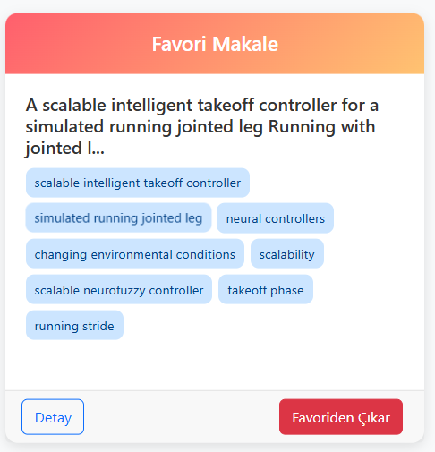

# NLP-FastText-SciBERT-Makale Öneri

Makale Öneri Sistemi, kullanıcıların ilgi alanlarına göre akademik makaleleri öneren, modern ve kullanıcı dostu bir web uygulamasıdır. FastText ve SciBERT modellerini kullanarak makale metinlerini vektör temsiline dönüştürür, kosinüs benzerliği ile makaleler arasındaki benzerliği hesaplar ve öneri listesi oluşturur. Kullanıcılar favori makalelerini yönetebilir, profil düzenleyebilir ve dinamik precision/recall ölçümleri sayesinde öneri kalitesini takip edebilirler.

---

## İçindekiler

- [Genel Bakış](#genel-bakış)
- [Özellikler](#özellikler)
- [Kullanılan Teknolojiler](#kullanılan-teknolojiler)
- [Kullanım](#kullanım)
- [Uygulama Görselleri](#uygulama-görselleri)
- [Precision & Recall](#precision--recall)
---

## Genel Bakış

Makale Öneri Sistemi, kullanıcıların seçtiği ilgi alanlarına göre akademik makaleleri öneren ve önerilerin kalitesini precision ve recall metrikleri ile değerlendiren bir sistemdir. Sistem, kullanıcı profilinde yer alan ilgi alanlarına göre, makale vektörleri arasında benzerlik hesaplaması yaparak en uygun makaleleri önerir. Ayrıca, kullanıcılar favori makalelerini yönetebilir ve detaylı makale sayfalarından makale içeriklerine, keyphrase’lere ve vektör verilerine ulaşabilir.

---

## Özellikler

### **Kullanıcı Yönetimi**
- Giriş ve kayıt işlemleri (ilgi alanları seçimi dahil)
- Profil düzenleme (şifre güncelleme ve ilgi alanı yönetimi)

### **Makale Önerileri**
- FastText ve SciBERT modelleri
- Precision ve recall metrikleri ile öneri kalitesinin dinamik ölçümü

### **Favori Yönetimi**
- Makaleleri favorilere ekleme ve favorilerden çıkarma
- Favori makaleler için ayrı bir sayfa üzerinden detaylı listeleme

### **Makale Detayları**
- Makale içeriği, keyphrase’ler ve vektör değerlerinin sunulması
- Yorum yapma özelliği

### **Karanlık Mod Desteği**
- Tüm sayfalar hem açık hem de karanlık modda uyumlu çalışır
- Kullanıcı, navbar’daki toggle butonuyla modlar arasında geçiş yapabilir, tercih localStorage ile saklanır

### **Responsive Tasarım**
- Modern ve şık kullanıcı arayüzü

---

## Kullanılan Teknolojiler

- **Backend:**
  - **Python (Flask)**
  - **MongoDB**

- **NLP & Embedding:**
  - **FastText**
  - **SciBERT (Transformers, PyTorch)**

- **Frontend:**
  - **HTML5, CSS3 (Bootstrap 5)**
  - **JavaScript** (Dark Mode Toggle, Scroll-to-top, Toggle for Vectors)

---

## Kullanım

### Ön Gereksinimler

- Python 
- MongoDB 
- Gerekli Python paketleri (`requirements.txt` dosyasından kurulabilir)
  
**Konfigürasyonu Ayarlayın:**

   `config.py` dosyasında aşağıdaki ayarları güncelleyin:
   - `MONGO_URI`: MongoDB bağlantı adresi.
   - `DB_NAME`: Kullanılacak veritabanı adı.
   - `FASTTEXT_MODEL_PATH`: FastText model dosyasının tam yolu (örneğin, `D:\cc.en.300.bin`).
   - `SCIBERT_MODEL_NAME`: SciBERT modeli (örneğin, `"allenai/scibert_scivocab_uncased"`).
   - `TOP_INTERESTS`: Varsayılan ilgi alanlarını içeren liste (örneğin, veritabanındaki en çok geçen 20 kelime).

---
## Precision & Recall

- **Precision:** Önerilen makaleler arasında gerçekten kullanıcı ilgi alanına uygun olanların oranıdır.
- **Recall:** Veritabanındaki tüm ilgili makalelerden kaç tanesinin öneri listesinde yer aldığını gösterir.

Örneğin, eğer sistem 5 makale öneriyorsa ve bunlardan 4'ü gerçekten ilgiliyse, precision 0.8 olur. Ancak veritabanında 100 ilgili makale varsa, recall oldukça düşük çıkabilir. Bu metrikler, sistemin öneri kalitesini ölçmek için kullanılır. Öneri sayısı ve benzerlik eşik değerleri ile denge sağlanabilir.

---

## Uygulama Görselleri

### **1. Anasayfa**

### **2. Karanlık Modda Anasayfa**

### **3. Kayıt Ekranı**

### **4. Karanlık Modda Kayıt Ekranı**

### **5. Favoriler**

### **6. Karanlık Modda Favoriler**

### **7. Makale Detay**

### **8. Karanlık Modda Makale Detay**

### **9. Profil Düzenle**

### **10. Karanlık Modda Profil Düzenle**

---

